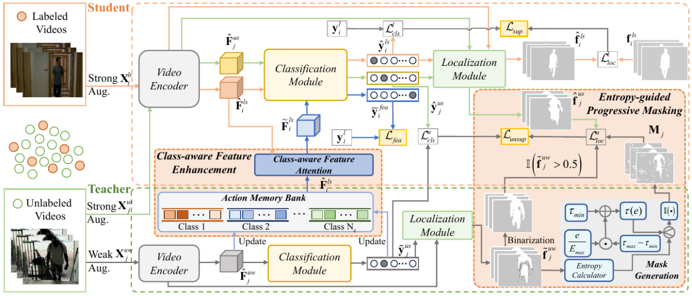
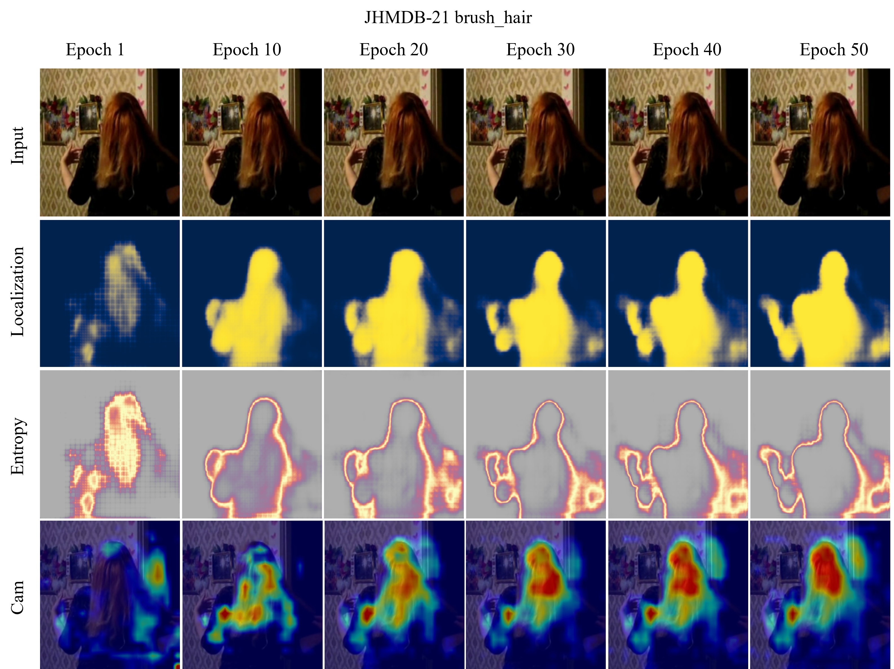

# CEPM

This repository contains the open-source release of **Class-aware Entropy-guided Progressive Masking for Semi-Supervised Video Action Detection (CEPM)**. This release is organized for the `JHMDB-21` setup only, and only the `JHMDB-21` configuration file is provided for training and evaluation.

## 🔍 Abstract

Video Action Detection (VAD) aims to perform spatiotemporal localization of human actions. Since action annotations are very costly, semi-supervised VAD that employs limited labeled data and rich unlabeled data has become an important task. However, it still faces two challenges, \ie, insufficient labeled samples restrict the feature diversity, and low-quality pseudo-labels weaken model training. To address these issues, we propose a Class-aware Entropy-guided Progressive Masking (CEPM) approach for semi-supervised VAD. In particular, CEPM introduces the Class-aware Feature Enhancement (CFE) module, which fuses the features of the labeled samples and those of the unlabeled ones within the same class, thereby promoting intra-class feature diversity. It further adopts a teacher-student framework to generate pseudo-labels of the unlabeled samples and designs the Entropy-guided Progressive Masking (EPM) module. EPM selects the varying low-entropy regions of the frames in a curriculum learning manner, and improves the quality of the pseudo-labels for guiding the student model. Extensive experiments on three video benchmarks, namely UCF101-24, JHMDB-21, and AVA, demonstrate the superiority of the proposed semi-supervised approach. 

<p align="center">

</p>

## 🚀 Installation

- Create conda environment:
```bash
conda create -n cepm python=3.8.16
conda activate cepm
```

- Install PyTorch:
```bash
pip install torch==1.10.0+cu113 torchvision==0.11.0+cu113 torchaudio==0.10.0 -f https://download.pytorch.org/whl/torch_stable.html
```

- Install other libraries:
```bash
pip install -r requirements.txt
```

## 📦 Data Preparation
- Please refer to the dataset preparation steps for [J-HMDB](https://serre-lab.clps.brown.edu/resource/hmdb-a-large-human-motion-database/).

- Organize the data folders as follows:

```bash
data
|-- JHMDB21
|   |-- Videos
|   |   `-- ReCompress_Videos
|   |-- Puppet_mask
|   `-- ...
```

## 🧠 Models
- Please download the pretrained I3D initialization weights from [pytorch-i3d](https://github.com/piergiaj/pytorch-i3d/tree/master/models). After downloading, make sure the file is located at `path/to/weights/rgb_charades.pt`.

## ⚙️ Configuration
- `semi_jhmdb_final.py`: J-HMDB-21 semi-supervised training.
- `multi_model_evalCaps_jhmdb.py`: J-HMDB-21 evaluation.

## 📊 Main Results on J-HMDB-21
The table below reports the main results on the J-HMDB-21 dataset under the 20% labeled split.

| Method | Backbone | Annot. | f-mAP@0.5 | v-mAP@0.2 | v-mAP@0.5 |
| --- | --- | --- | --- | --- | --- |
| MixMatch | I3D | 30% | 7.5 | 46.2 | 5.8 |
| Pseudo-label | I3D | 20% | 55.3 | 87.6 | 52.0 |
| ISD | I3D | 20% | 57.8 | 90.2 | 57.0 |
| E2E-SSL | I3D | 20% | 59.1 | 93.2 | 58.7 |
| Supervised baseline | I3D | 20% | 55.7 | 93.9 | 52.4 |
| Baseline Mean Teacher | I3D | 20% | 56.3 | 88.8 | 52.8 |
| Stable Mean Teacher | I3D | 20% | 69.8 | **98.8** | 70.7 |
| **CEPM (Ours)** | I3D | 20% | **72.0** | 98.4 | **72.8** |

## 🏋️ Training
```bash
CUDA_VISIBLE_DEVICES=2 python semi_jhmdb_final.py \
  --epochs 50 \
  --bs 8 \
  --lr 1e-4 \
  --txt_file_label jhmdb_classes_list_per_20_labeled.txt \
  --txt_file_unlabel jhmdb_classes_list_per_80_unlabeled.txt \
  --wt_loc 1 \
  --wt_cls 1 \
  --wt_cons 0.3 \
  --const_loss l2 \
  --recon_start_epoch 11 \
  --beta 2.0 \
  --entropy_thresh_min 0.1 \
  --entropy_thresh_max 0.5 \
  --queue_size 32 \
  --num_attention_layers 2 \
  --fusion_mode diff_cross_attention \
  --thresh_epoch 11 \
  -at 2 \
  -ema 0.99 \
  --opt3 \
  --opt4 \
  --ramp_thresh 0 \
  --scheduler \
  --jhmdb_dataset_path path/to/workspace/datasets/JHMDB21/Videos/ReCompress_Videos \
  --jhmdb_exp_save_path path/to/workspace/outputs/jhmdb \
  --exp_id 20_per/semi_jhmdb_final
```

## ✅ Validation
```bash
python multi_model_evalCaps_jhmdb.py \
  --jhmdb_dataset_path path/to/workspace/datasets/JHMDB21/Videos/ReCompress_Videos \
  --jhmdb_exp_save_path path/to/workspace/outputs/jhmdb \
  --ckpt 20_per/semi_jhmdb_final
```

## 🖼️ Qualitative Analysis

<p align="center">

</p>

## 📬 Contact

If you have any questions, please feel free to contact Mr. Lingfeng He via email (232050197@hdu.edu.cn).

## 🙏 Acknowledgements

This project is built upon [Stable Mean Teacher](https://github.com/AKASH2907/stable-mean-teacher) and [VideoCapsuleNet](https://github.com/noureldien/videocapsulenet). We sincerely thank contributors of these great open-source repositories.

## 📝 Citation
If this project helps your research, please update the citation entry below with your final publication metadata:

```bibtex
@article{cepm,
  title={Class-aware Entropy-guided Progressive Masking for Semi-Supervised Video Action Detection},
  author={Ping Li and Lingfeng He and Junyu Liu and Jiachen Men},
  journal={To be updated},
  year={2026}
}
```
